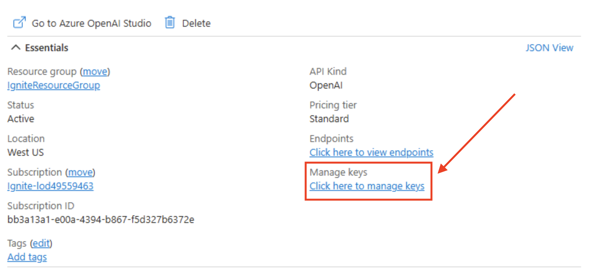
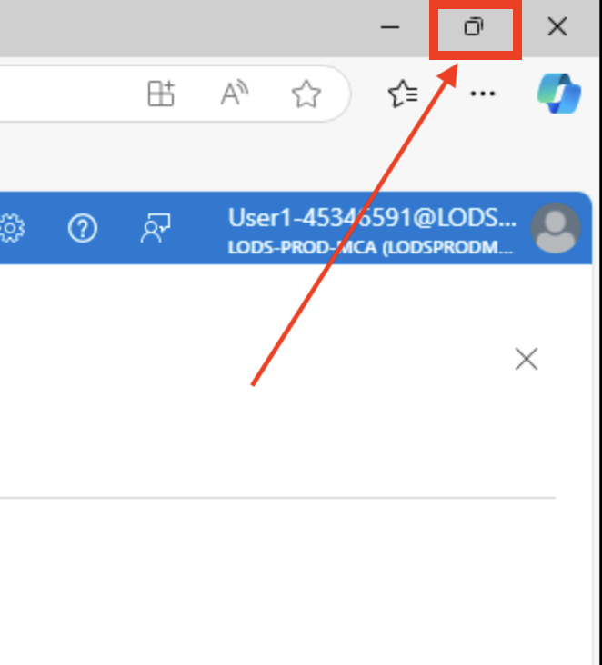
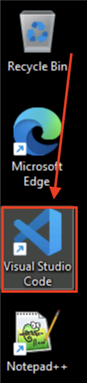
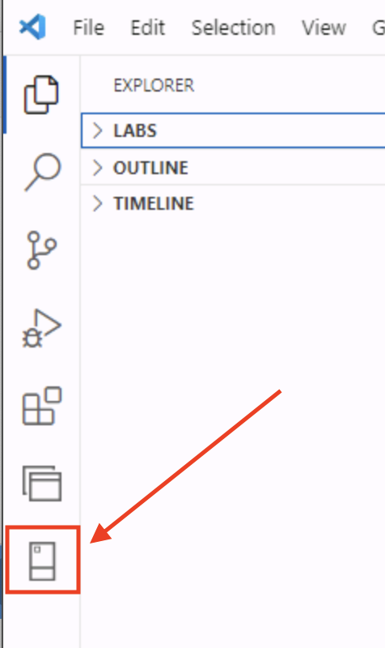
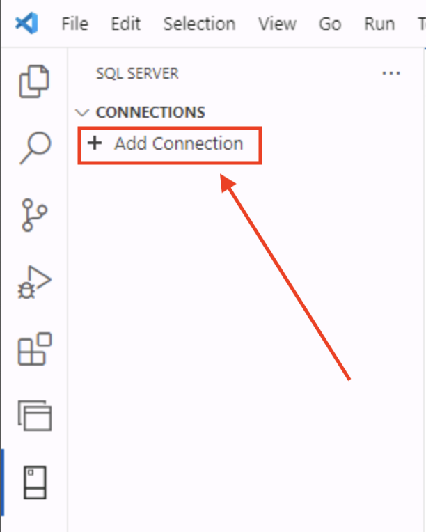
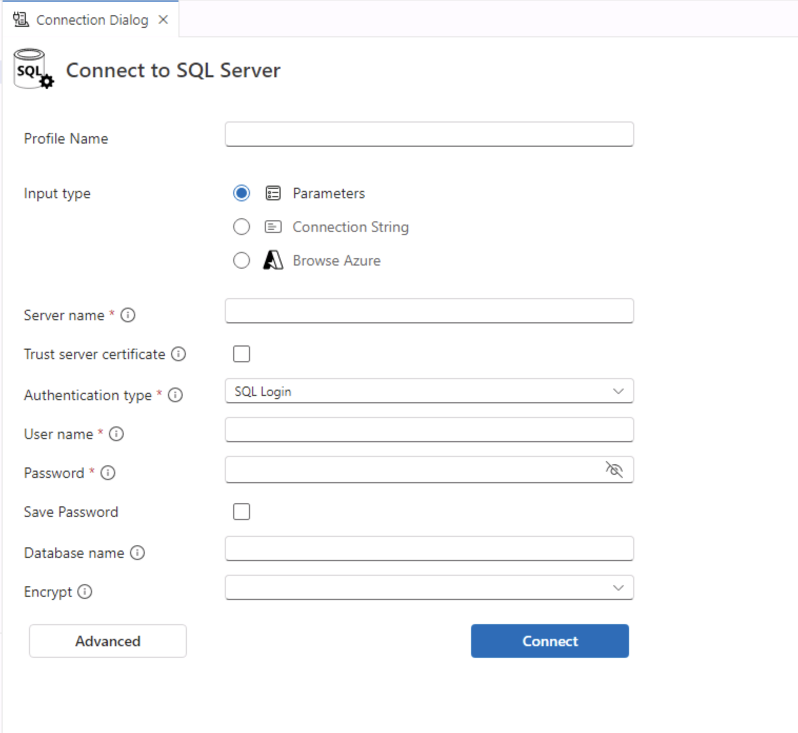
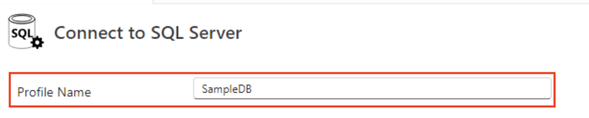
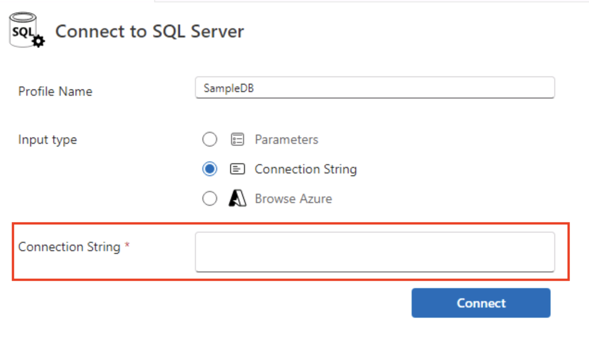
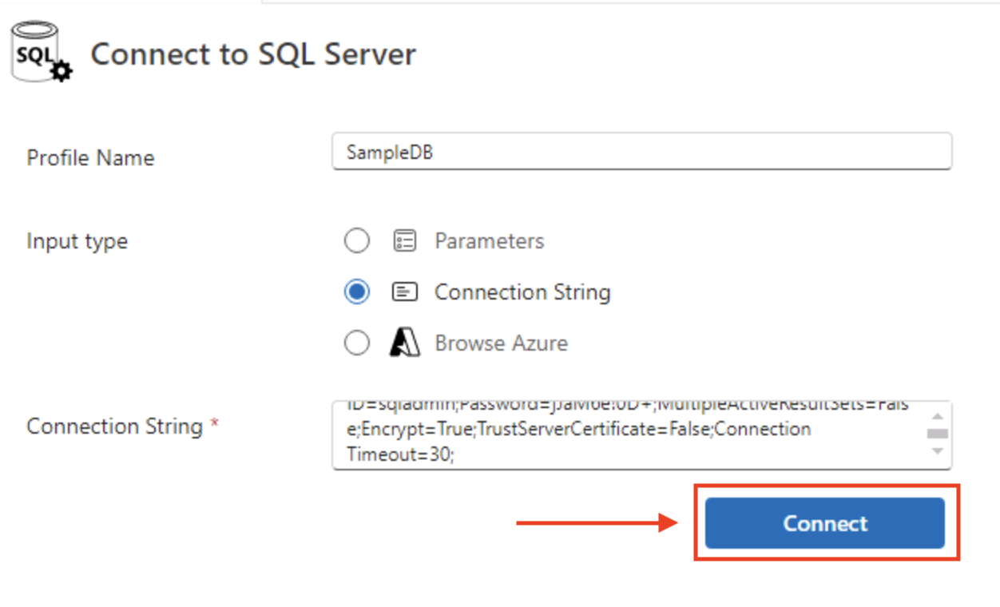
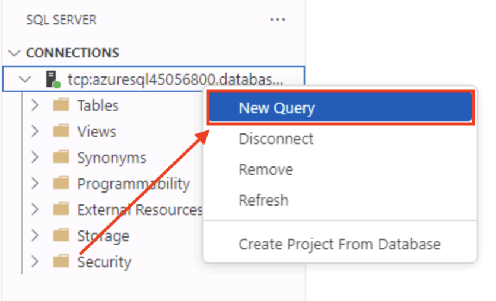

# 1. The Azure Portal and Connecting to an Azure SQL Database

The next section of the workshop you will be browsing pre-created resources, gathering connection information, and connecting to an Azure SQL Database.

## Logging into the Azure Portal

1. Once you have logged into the virtual machine, open the Edge browser by double clicking it.

    

1. After the browser starts, you should be on the Azure Sign In page

    {640}

    If you do not get the Azure login page when Edge opens, please navigate to +++https://portal.azure.com+++ by typing it in the URL or by using the link in the bookmarks bar.

    {400}

1. On the Sign In page, use the following username in the Email, phone, or Skype field:

    > [!TIP]
    > Remember, you can just click on the following text and it will type it in the VM for you.

    +++@lab.CloudPortalCredential(User1).Username+++

    {400}

1. then click the **blue Next button** after the username has been entered

    {400}

1. Next, use the password field and enter the following password:

    > [!TIP]
    > Remember, you can just click on the following text and it will type it in the VM for you.

    +++@lab.CloudPortalCredential(User1).Password+++

    {400}

1. then click the **blue Sign in button** after the password has been entered

    {400}

1. For the next dialog window, select the **Blue Yes Button** so that you can stay logged into Azure without having to reenter the username and password.

    {400}

    You may get a Welcome to Azure page. If so, just click **Cancel** on the bottom right of the page.

    {800}

1. You are now logged into Azure!

    {800}

## Azure Resources

1. While on the **Azure Portal Home Page**, find the **View all resources button** in the middle of the page. **Click** on this button.

    {600}

1. On the following page, you will see 3 pre-created resources for you to use in the lab. An Azure SQL Server, a SQL Database, and an Azure OpenAI instance with 2 deployed models; one for creating embeddings and one to use for our chat application.

    {1200}

    > [!WARNING]
    > **If you don't see all 3 resources, they may still be in the process of creation. Wait a minute or 2 and click the refresh button.** 

1. Start by clicking the Azure OpenAI instance. It will be named **igniteai@lab.LabInstance.Id**.

    {1200}

1. Once clicked, you will be on the Azure OpenAI instance details page.

    {1200}

1. On the right side of the page, find the **Manage Keys** item and click where it says **"Click here to manage keys"**.

    {1200}

1. On the **Keys and Endpoints** details page,

    {1200}

1. Click the copy link for **KEY 1**. This will copy the key into your clipboard.

    {1200}

1. Paste the key in this text box so that it can be used in upcoming code sections.

    > [!ALERT]
    > **Paste the Azure OpenAI Key Here -->** @lab.TextBox(aiKey)

1. Did you remember to paste the key into the above text field?

1. To make the next sections a bit more navigation friendly, **click the zoom/maximize/window button** in the **upper right corner** of the browser window.

    {400}

## Connect to the free Azure SQL Database

#### **Using Visual Studio Code**

Visual Studio Code will be used for working with the database.

1. Back on the Windows desktop, double click the **Visual Studio Code icon** on the right side.

    {100}

1. When Visual Studio Code opens, click the **SQL Extension** on the left side.

    {300}

1. Next, click **Add Connection** in the SQL Extension. *(The Add Connection option might take a few seconds to load.)*

    {300}

1. A SQL **Connection Dialog** tab will appear in the VS Code editor.

    {900}

1. For the **Profile Name** field, enter **SampleDB**.

    {800}

1. Next, for **Input type**, select the **Connection String** radio button.

    {800}

1. In the **Connection String** text box, 

    {800}

    copy and paste the following connect string:

    ```
    Server=tcp:azuresql@lab.LabInstance.Id.database.windows.net,1433;Initial Catalog=SampleDB;Persist Security Info=False;User ID=sqladmin;Password=@lab.CloudPortalCredential(User1).Password;MultipleActiveResultSets=False;Encrypt=True;TrustServerCertificate=False;Connection Timeout=30;
    ```

    then press the **blue Connect button**.

    {800}

1. Once connected to the database, **right click** on the database in the connection navigator on the left side and choose **New Query**.

    

1. You are now connected to the Azure SQL Database!