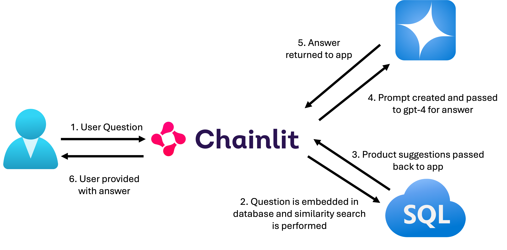

# 5. Creating a chat application using RAG on relational data

In this section of the lab, you will be deploying a RAG application that uses embeddings, vector similarity search, relational data, and a large language model to craft an answer to someone looking for advice on Adventure Works products. In essence, putting all the pieces together in the previous sections to create a working chat application.

The framework for our application will be using Chainlit. Chainlit is an open-source Python package to build production ready Conversational AI applications that has integrations with popular libraries and frameworks. This application we are using is paired with LangChain. And what's LangChain? It's an open-source framework that allows developers to create applications using large language models (LLMs), and in our case, Azure OpenAI's deployed gpt-4 model.


## Application Overview

The flow of our application is as follows:



A user submits a question about a product via the Chainlit front end. That question is then sent to the database where it is embedded and a vector similarity search is done to match products to the question. The result of that search is then passed back to the Chainlit application where it constructs a prompt. This prompt is then passed over to Azure OpenAI (gpt-4) and recieved the answer. This answer is then presented back to the user via the Chainlit application.

In the section of the lab, you will create a stored procedure that will be used by the Chainlit application for taking in questions and returning products. Next, you will start up the application and interact with it to ask questions about Adventure Works products, just as we did previously with T-SQL calls.

## Creating the stored procedure used by the application

1. Run the following SQL in a blank query editor in VS Code:

    ```SQL
    create or alter procedure [dbo].[find_products]
    @text nvarchar(max),
    @top int = 10,
    @min_similarity decimal(19,16) = 0.80
    as
    if (@text is null) return;
    declare @retval int, @qv vector(1536);
    exec @retval = dbo.create_embeddings @text, @qv output;
    if (@retval != 0) return;
    with vector_results as (
    SELECT 
            p.Name as product_name,
            ISNULL(p.Color,'No Color') as product_color,
            c.Name as category_name,
            m.Name as model_name,
            d.Description as product_description,
            p.ListPrice as list_price,
            p.weight as product_weight,
            vector_distance('cosine', @qv, p.embeddings) AS distance
    FROM
        [SalesLT].[Product] p,
        [SalesLT].[ProductCategory] c,
        [SalesLT].[ProductModel] m,
        [SalesLT].[vProductAndDescription] d
    where p.ProductID = d.ProductID
    and p.ProductCategoryID = c.ProductCategoryID
    and p.ProductModelID = m.ProductModelID
    and p.ProductID = d.ProductID
    and d.Culture = 'en')
    select TOP(@top) product_name, product_color, category_name, model_name, product_description, list_price, product_weight, distance
    from vector_results
    where (1-distance) > @min_similarity
    order by    
        distance asc;
    GO
    ```

    This code creates a stored procedure called **find_products**. It will be called by the Chainlit application in the **utilities.py** file as seen here:

    > [!TIP]
    > **This code is for reference only** 

    ```python-nocopy
    def get_products(search_text:str) -> str:
    conn = get_mssql_connection("AZURE_SQL_CONNECTION_STRING")
    logging.info("Querying MSSQL...")
    logging.info(f"Message content: '{search_text}'")
    try:        
        cursor = conn.cursor()            
        results = cursor.execute("SET NOCOUNT ON; EXEC dbo.find_products @text=?", (search_text)).fetchall()
        logging.info(f"Found {len(results)} similar products.")
        payload = ""
        for row in results: 
            payload += f'product name: {row[0]}|color: {row[1]}|category: {row[2]}|model: {row[3]}|description: {row[4]}|"price: "{row[5]}|"product weight: "{row[6]}'
            payload += "\n"
        return payload    
    finally:
        cursor.close()
    ```

1. You can test this newly created procedure to see how it will interact with the Chainlit application by running the following SQL in a blank query editor in VS Code:

    ```SQL
    exec find_products 'Im looking for a red bike'
    ```

    

## Create a web application user

In this section, we are going to create a limited privilege web application user that the Chainlit application will connect to the database with. Its never a good idea to have your sqladmin user be the user we connect to the database with in an application.

1. Run the following SQL in a blank query editor in VS Code:

    > [!KNOWLEDGE]
    > **The ODBC database connection string used here contains the limited privilege user (aiuser) you just created.** 
    
    ```SQL
    CREATE USER [aiuser] WITH PASSWORD = 'kAgH7e!0D$#';

    ALTER ROLE db_datareader ADD MEMBER [aiuser];

    GRANT EXECUTE ON SCHEMA::dbo TO [aiuser];

    GRANT EXECUTE ANY EXTERNAL ENDPOINT TO [aiuser];

    GRANT REFERENCES ON DATABASE SCOPED CREDENTIAL :: [https://YOUR_AI_ENDPOINT_NAME.openai.azure.com/] TO [aiuser];
    ```

## Create the .env file with a database connection string

1. Start by using the **File Explorer** in Visual Studio Code 

    
    
    and expanding the chainlit directory

    {

1. Right click on the chainlit directory and select **New File**.

    

1. Name the new file .env and then press enter/return.

    

1. Open the file in the Visual Studio Code editor by clicking on the filename if not already done for you.

    

1. Copy and paste the following parameters into the .env file and save it.

    ```ENV
    AZURE_OPENAI_ENDPOINT="https://YOUR_AI_ENDPOINT_NAME.openai.azure.com/"
    AZURE_OPENAI_API_KEY="@lab.Variable(aiKey)"
    AZURE_OPENAI_CHAT_DEPLOYMENT_NAME="gpt-4"
    AZURE_OPENAI_EMBEDDINGS_DEPLOYMENT_NAME="text-embedding-ada-002"
    AZURE_OPENAI_API_VERSION="2024-06-01"
    AZURE_SQL_CONNECTION_STRING='Driver={ODBC Driver 18 for SQL Server};Server=tcp:azuresql@YOUR_AZURE_SQL_SERVER_NAME.database.windows.net,1433;Database=YOUR_DATABASE_NAME;Uid=aiuser;Pwd=kAgH7e!0D$#;Encrypt=yes;TrustServerCertificate=no;Connection Timeout=30;'
    ```

    

1. **Save** the file

## Starting and using the Chainlit application

1. Start by going to a Visual Studio Code **terminal session**. You can do this 3 ways.

    One, Use the menu bar on the top of Visual Studio Code, select **View** and then click on **Terminal**.

    

    Two, Use the menu bar on the top of Visual Studio Code, select **Terminal** and then click on **New Terminal**.

    

    Three, Use the **TERMINAL** tab on the **bottom** of the Visual Studio Code Editor.

    

1. Once in the terminal, change the directory to the chainlit directory with the following command:

    ```BASH
    cd chainlit
    ```

    And then press enter/return.

1. Next, start up the application with the following command again, in the Visual Studio Code terminal session:

    ```BASH
    chainlit run app.py
    ```

    And then press enter/return.

    > [!TIP]
    > You may see this pop up in Visual Studio Code in the lower right of the screen. Just **click the X** and close the pop-up.
    >

1. A browser window should open once the application has started. 

    

    Now that the application is running, use the chat text area to ask a question.

    

    Start by asking it one of the questions we previously asked in T-SQL:

    ```TEXT
    Do you sell any padded seats that are good on trails?
    ```

    

    And see what the answer is:

    

1. Try the helmet question:

    ```TEXT
    Do you have any lightweight helmets?
    ```

    


1. Now, ask about yellow jerseys:

    ```TEXT
    Do you sell any yellow jerseys?
    ```

    

1. Give it a try and ask more product questions!

    